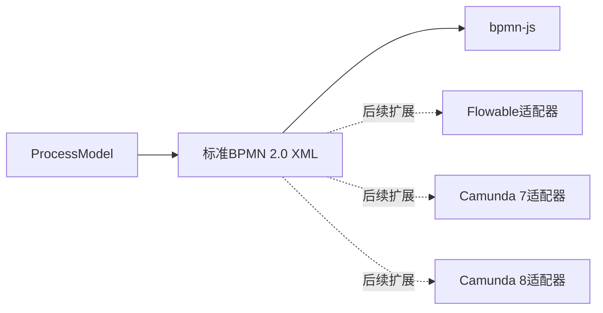
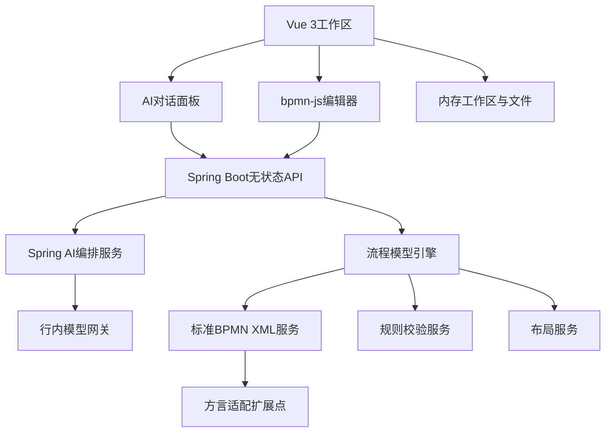
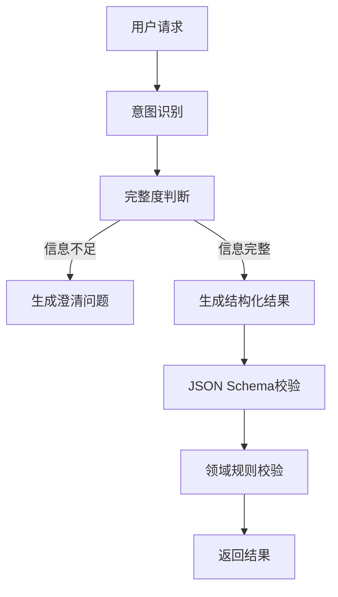
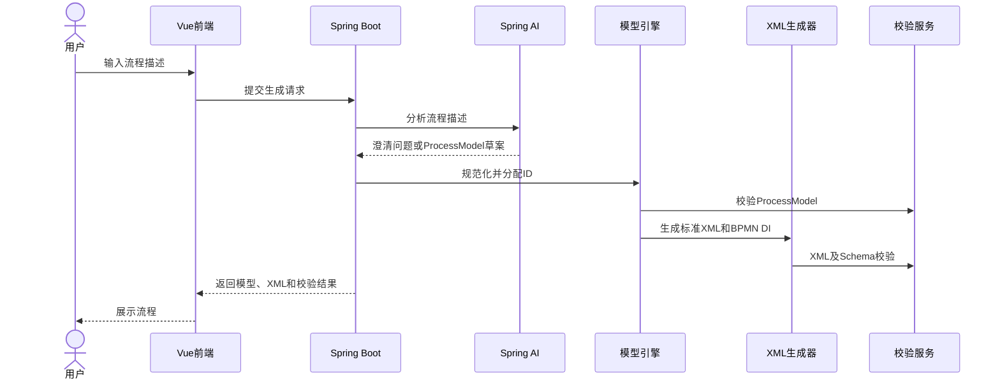
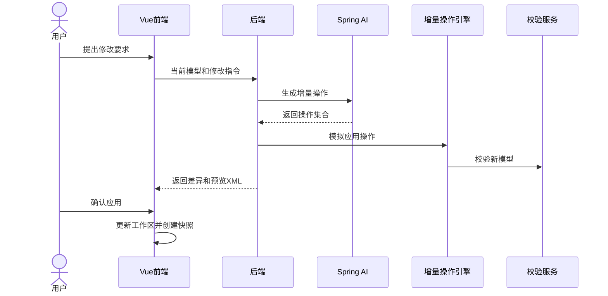

# AI辅助BPMN流程图生成与编辑系统详细设计

> 建议文件名：`DESIGN.md`  
> 本文档可直接作为AI Coding工具的项目级开发规格。

---

## 1. 文档概述

### 1.1 文档目的

本设计用于指导AI Coding工具开发一套AI辅助BPMN流程图生成与编辑Web系统。

系统支持：

1. 用户通过自然语言描述生成BPMN流程图；
2. AI识别流程中的角色、步骤、分支、并行及异常路径；
3. 对描述不完整或者存在歧义的内容进行澄清；
4. 生成厂商中立的标准BPMN 2.0 XML；
5. 在浏览器中展示BPMN流程图；
6. 用户通过拖拉方式手工编辑流程；
7. 用户通过多轮对话增加、删除或者修改流程元素；
8. AI修改采用结构化增量操作；
9. AI修改前展示差异，由用户确认后应用；
10. AI修改时保留用户已经调整的节点布局；
11. 支持BPMN 2.0 XML导入和导出；
12. 支持本地撤销、恢复和版本快照；
13. 支持BPMN结构、语义及行内规则检查；
14. 使用Spring AI直接编排行内大模型；
15. 预留Flowable、Camunda等平台兼容转换扩展点。

### 1.2 系统定位

系统定位为：

> AI辅助需求平台中的通用流程建模能力。

系统只负责流程设计和建模，不负责：

- 部署BPMN流程；
- 执行BPMN流程；
- 管理流程实例；
- 管理待办任务；
- 调用Flowable或者Camunda流程引擎；
- 服务端长期保存流程项目；
- 多用户实时协同编辑。

### 1.3 主要技术决策

| 项目 | 技术决策 |
|---|---|
| 前端框架 | Vue 3、TypeScript、Vite |
| Vue开发模式 | Composition API、`<script setup>` |
| BPMN编辑器 | bpmn-js |
| 状态管理 | Pinia |
| UI组件 | Ant Design Vue |
| 后端框架 | Java 21、Spring Boot 3 |
| Agent编排 | Spring AI |
| 大模型 | 行内Qwen模型或OpenAI兼容模型网关 |
| 语义模型 | ProcessModel JSON |
| 交换格式 | 标准BPMN 2.0 XML |
| XML生成 | Java StAX |
| 数据库 | 不使用 |
| 服务端状态 | 无状态 |
| 第一阶段流程平台依赖 | 无 |
| 后续扩展 | Flowable、Camunda 7、Camunda 8适配器 |

---

# 2. 建设范围

## 2.1 第一阶段范围

第一阶段只生成和处理厂商中立的标准BPMN 2.0 XML。

生成结果不得主动包含：

- `flowable:*`属性或扩展元素；
- `camunda:*`属性或扩展元素；
- `zeebe:*`属性或扩展元素；
- 特定流程引擎的任务监听器；
- 特定流程引擎的表单绑定；
- Java Class；
- Delegate Expression；
- Connector配置；
- 特定引擎的审批人表达式；
- 特定引擎的重试和异常策略。

生成流程默认设置：

```xml
isExecutable="false"
```

## 2.2 后续扩展范围

后续通过方言适配器支持：

- Flowable兼容转换；
- Camunda 7兼容转换；
- Camunda 8/Zeebe兼容转换；
- 行内流程平台兼容转换；
- 平台特定属性配置；
- 平台特定校验规则；
- 标准模型与平台模型差异报告。

## 2.3 非建设范围

当前版本不建设：

- 数据库表；
- 服务端项目管理；
- 服务端版本管理；
- 服务端对话记录；
- 流程发布审批；
- 流程执行引擎；
- 多人协同编辑；
- 流程实例监控；
- 流程任务中心；
- 流程运行数据分析。

---

# 3. 核心设计原则

## 3.1 AI不直接生成或维护BPMN XML

大模型负责：

- 理解业务描述；
- 识别流程角色；
- 识别任务、事件和网关；
- 判断是否需要澄清；
- 生成ProcessModel草案；
- 生成增量修改操作；
- 解释流程；
- 提出优化建议。

程序负责：

- 元素ID生成；
- 节点和连线引用；
- ProcessModel校验；
- 增量操作应用；
- BPMN XML生成；
- BPMN XML解析；
- BPMN DI生成；
- 节点坐标和连线路径；
- 差异比较；
- 规则校验。

大模型不得直接输出最终BPMN XML。

## 3.2 ProcessModel是语义事实源

系统同时维护：

| 数据 | 作用 |
|---|---|
| `ProcessModel JSON` | 表达流程业务语义，供AI理解和修改 |
| `BPMN XML` | 用于标准交换、导入导出和前端展示 |
| `BPMN DI` | 保存节点坐标、大小和连线路径 |
| `WorkspaceState` | 保存前端版本、对话和待确认修改 |

## 3.3 AI修改采用增量操作

AI修改已有流程时，只能返回白名单操作：

- `ADD_NODE`
- `UPDATE_NODE`
- `DELETE_NODE`
- `MOVE_NODE`
- `ADD_FLOW`
- `UPDATE_FLOW`
- `DELETE_FLOW`
- `ADD_POOL`
- `UPDATE_POOL`
- `DELETE_POOL`
- `ADD_LANE`
- `UPDATE_LANE`
- `DELETE_LANE`
- `ADD_BRANCH`
- `ADD_PARALLEL_BRANCH`

AI不得直接替换完整ProcessModel或者完整BPMN XML。

## 3.4 先预览，后应用

所有AI修改必须经过：

1. 用户提出修改要求；
2. Spring AI生成增量操作；
3. 后端模拟应用操作；
4. 后端校验修改后的模型；
5. 后端生成预览XML；
6. 后端计算差异；
7. 前端展示差异；
8. 用户确认；
9. 前端应用修改；
10. 前端生成本地版本快照。

## 3.5 后端保持无状态

后端不得依赖：

- PostgreSQL；
- MySQL；
- Redis；
- MongoDB；
- 服务端Session；
- 服务端文件系统；
- 服务端版本表；
- 服务端对话表。

每个请求必须携带完成当前操作所需的上下文。

## 3.6 标准优先、方言隔离



标准BPMN生成器不得包含任何Flowable或者Camunda判断逻辑。

---

# 4. 总体架构



## 4.1 前端职责

Vue前端负责：

- 工作区管理；
- BPMN图展示；
- BPMN手工编辑；
- AI对话；
- 差异预览；
- 待确认修改管理；
- 本地版本快照；
- 撤销和恢复；
- BPMN文件导入导出；
- 工作区JSON导入导出；
- 校验结果展示；
- 错误定位。

## 4.2 后端职责

Spring Boot后端负责：

- Spring AI模型调用；
- 意图识别；
- 信息完整度判断；
- 澄清问题生成；
- ProcessModel生成；
- 增量修改操作生成；
- ProcessModel规范化；
- 增量操作模拟和应用；
- 标准BPMN XML生成；
- 标准BPMN XML解析；
- BPMN DI处理；
- 图结构校验；
- BPMN Schema校验；
- 行内规则校验；
- 方言适配器注册。

## 4.3 推荐技术栈

| 层级 | 推荐技术 |
|---|---|
| 前端框架 | Vue 3、TypeScript、Vite |
| Vue开发模式 | Composition API、`<script setup>` |
| BPMN编辑器 | bpmn-js、bpmn-moddle |
| 状态管理 | Pinia |
| 路由 | Vue Router |
| UI组件 | Ant Design Vue |
| HTTP客户端 | Axios |
| 后端 | Java 21、Spring Boot 3 |
| Agent编排 | Spring AI |
| JSON处理 | Jackson |
| JSON Schema | JSON Schema Validator |
| XML生成 | Java StAX `XMLStreamWriter` |
| XML解析 | 安全配置的StAX或DOM |
| XML标准校验 | JAXP Schema Validator |
| 自动布局 | bpmn-auto-layout或自定义布局 |
| 后端测试 | JUnit 5、Mockito、Spring Boot Test |
| 前端测试 | Vitest、Vue Test Utils |
| 端到端测试 | Playwright |
| API文档 | OpenAPI 3、Swagger UI |
| 后端构建 | Maven |
| 前端构建 | npm |
| 数据库 | 不使用 |

---

# 5. 系统模块设计

## 5.1 前端工作区模块

负责管理当前浏览器中的流程工作区。

主要功能：

- 新建工作区；
- 打开BPMN文件；
- 打开工作区JSON；
- 保存当前修改；
- 导出BPMN文件；
- 导出工作区JSON；
- 管理当前revision；
- 创建本地快照；
- 撤销和恢复；
- 管理待确认AI修改；
- 管理当前对话上下文。

## 5.2 AI对话模块

主要功能：

- 接收自然语言流程描述；
- 判断描述是否完整；
- 生成澄清问题；
- 生成ProcessModel；
- 修改现有流程；
- 解释当前流程；
- 检查流程；
- 提出优化建议；
- 使用当前选中节点作为对话上下文。

支持的意图：

| 意图 | 示例 |
|---|---|
| `CREATE_PROCESS` | 创建一个架构评审流程 |
| `ADD_NODE` | 在主管审批前增加Design Lead确认 |
| `UPDATE_NODE` | 将部门主管修改为科技主管 |
| `DELETE_NODE` | 删除人工登记环节 |
| `ADD_BRANCH` | 审批不通过时退回申请人 |
| `ADD_PARALLEL` | 安全评审和架构评审并行执行 |
| `CHANGE_OWNER` | 将初审调整为架构师负责 |
| `EXPLAIN_PROCESS` | 说明当前流程 |
| `VALIDATE_PROCESS` | 检查流程是否完整 |
| `OPTIMIZE_PROCESS` | 提出流程简化建议 |

`UNDO_CHANGE`和`REDO_CHANGE`由前端处理，不调用大模型。

## 5.3 BPMN编辑模块

基于bpmn-js实现。

必须支持：

- BPMN XML导入；
- BPMN图展示；
- 节点增加、删除和移动；
- 连线增加、删除和重新连接；
- 节点名称修改；
- Pool和Lane编辑；
- Properties Panel；
- Undo/Redo；
- Zoom In/Out；
- Fit Viewport；
- SVG导出；
- PNG导出；
- BPMN XML导出；
- 选中节点后发起AI修改；
- 高亮AI新增、修改和待删除元素。

## 5.4 流程模型引擎

负责：

- ProcessModel规范化；
- 元素ID分配；
- 引用完整性检查；
- 增量操作模拟；
- 增量操作应用；
- 图结构分析；
- 差异计算；
- 布局保留；
- 新节点局部布局。

## 5.5 标准BPMN XML模块

负责：

- ProcessModel转标准BPMN 2.0 XML；
- 标准BPMN XML解析为ProcessModel；
- BPMN DI生成和解析；
- BPMN XSD校验；
- XML安全校验；
- 标准命名空间管理。

第一阶段不得依赖Flowable或者Camunda Model API。

## 5.6 校验模块

负责：

- JSON Schema校验；
- 节点引用校验；
- 图可达性校验；
- 网关规则校验；
- BPMN XML Schema校验；
- BPMN DI校验；
- 行内流程规范校验。

## 5.7 方言适配模块

第一阶段只定义扩展接口，不实现Flowable、Camunda转换逻辑。

---

# 6. BPMN元素支持范围

| BPMN元素 | 第一阶段 |
|---|---|
| Start Event | 必须支持 |
| End Event | 必须支持 |
| User Task | 必须支持 |
| Service Task | 必须支持 |
| Manual Task | 必须支持 |
| Business Rule Task | 建议支持 |
| Exclusive Gateway | 必须支持 |
| Parallel Gateway | 必须支持 |
| Inclusive Gateway | 第二阶段 |
| Sequence Flow | 必须支持 |
| Message Flow | 建议支持 |
| Pool | 必须支持 |
| Lane | 必须支持 |
| Sub Process | 建议支持 |
| Boundary Event | 第二阶段 |
| Timer Event | 第二阶段 |
| Message Event | 第二阶段 |

---

# 7. 核心数据模型

## 7.1 ProcessModel

Pool和Lane必须分别建模，不能将Lane当作BPMN Participant。

```json
{
  "schemaVersion": "1.0",
  "modelId": "model_arch_review",
  "process": {
    "id": "process_arch_review",
    "name": "架构评审流程",
    "description": "项目架构评审及审批流程",
    "executable": false
  },
  "pools": [
    {
      "id": "pool_bank",
      "name": "银行",
      "processRef": "process_arch_review"
    }
  ],
  "lanes": [
    {
      "id": "lane_architect",
      "name": "架构师",
      "poolId": "pool_bank",
      "nodeRefs": [
        "event_start",
        "task_prepare"
      ]
    },
    {
      "id": "lane_design_lead",
      "name": "Design Lead",
      "poolId": "pool_bank",
      "nodeRefs": [
        "task_design_review"
      ]
    }
  ],
  "nodes": [
    {
      "id": "event_start",
      "type": "START_EVENT",
      "name": "开始",
      "laneId": "lane_architect",
      "documentation": null,
      "properties": {}
    },
    {
      "id": "task_prepare",
      "type": "USER_TASK",
      "name": "准备架构材料",
      "laneId": "lane_architect",
      "documentation": null,
      "properties": {}
    },
    {
      "id": "task_design_review",
      "type": "USER_TASK",
      "name": "确认架构方案",
      "laneId": "lane_design_lead",
      "documentation": null,
      "properties": {}
    }
  ],
  "sequenceFlows": [
    {
      "id": "flow_001",
      "sourceId": "event_start",
      "targetId": "task_prepare",
      "name": null,
      "condition": null,
      "defaultFlow": false
    },
    {
      "id": "flow_002",
      "sourceId": "task_prepare",
      "targetId": "task_design_review",
      "name": null,
      "condition": null,
      "defaultFlow": false
    }
  ],
  "messageFlows": [],
  "layout": {
    "nodes": {
      "event_start": {
        "x": 100,
        "y": 160,
        "width": 36,
        "height": 36
      },
      "task_prepare": {
        "x": 200,
        "y": 138,
        "width": 100,
        "height": 80
      }
    },
    "flows": {
      "flow_001": [
        {
          "x": 136,
          "y": 178
        },
        {
          "x": 200,
          "y": 178
        }
      ]
    }
  },
  "metadata": {
    "createdBy": "AI",
    "generationPrompt": null
  }
}
```

`metadata`只保存在工作区JSON中，默认不序列化到BPMN XML。

## 7.2 节点类型

```java
public enum NodeType {
    START_EVENT,
    END_EVENT,
    USER_TASK,
    SERVICE_TASK,
    MANUAL_TASK,
    BUSINESS_RULE_TASK,
    EXCLUSIVE_GATEWAY,
    PARALLEL_GATEWAY,
    INCLUSIVE_GATEWAY,
    SUB_PROCESS,
    INTERMEDIATE_CATCH_EVENT,
    INTERMEDIATE_THROW_EVENT
}
```

## 7.3 增量操作类型

```java
public enum OperationType {
    ADD_NODE,
    UPDATE_NODE,
    DELETE_NODE,
    MOVE_NODE,
    ADD_FLOW,
    UPDATE_FLOW,
    DELETE_FLOW,
    ADD_POOL,
    UPDATE_POOL,
    DELETE_POOL,
    ADD_LANE,
    UPDATE_LANE,
    DELETE_LANE,
    ADD_BRANCH,
    ADD_PARALLEL_BRANCH
}
```

## 7.4 增量修改请求

```json
{
  "requestId": "req-001",
  "baseRevision": 5,
  "instruction": "在准备材料后增加Design Lead确认，不通过时退回准备材料",
  "currentModel": {},
  "selectedElementIds": [
    "task_prepare"
  ],
  "conversationContext": []
}
```

## 7.5 AI增量修改输出

```json
{
  "summary": "增加Design Lead确认和拒绝退回路径",
  "clarificationRequired": false,
  "questions": [],
  "operations": [
    {
      "operationId": "op-001",
      "type": "ADD_NODE",
      "targetId": null,
      "payload": {
        "temporaryId": "new_node_1",
        "nodeType": "USER_TASK",
        "name": "确认架构方案",
        "laneId": "lane_design_lead",
        "insertAfter": "task_prepare"
      }
    },
    {
      "operationId": "op-002",
      "type": "ADD_NODE",
      "targetId": null,
      "payload": {
        "temporaryId": "new_gateway_1",
        "nodeType": "EXCLUSIVE_GATEWAY",
        "name": "是否通过",
        "insertAfter": "new_node_1"
      }
    },
    {
      "operationId": "op-003",
      "type": "ADD_FLOW",
      "targetId": null,
      "payload": {
        "sourceId": "new_gateway_1",
        "targetId": "task_prepare",
        "name": "不通过",
        "condition": "${approved == false}"
      }
    }
  ]
}
```

临时ID只能在单次模型响应中使用，正式ID由后端生成。

---

# 8. 前端工作区模型

## 8.1 WorkspaceState

```typescript
export interface WorkspaceState {
  workspaceId: string;
  name: string;
  revision: number;
  processModel: ProcessModel | null;
  bpmnXml: string | null;
  conversation: ConversationMessage[];
  pendingChange: ChangePreview | null;
  history: WorkspaceSnapshot[];
  historyIndex: number;
  dirty: boolean;
  lastModifiedAt: string;
}
```

## 8.2 WorkspaceSnapshot

```typescript
export interface WorkspaceSnapshot {
  revision: number;
  source:
    | 'AI_CREATE'
    | 'AI_MODIFY'
    | 'MANUAL'
    | 'IMPORT'
    | 'RESTORE';
  summary: string;
  processModel: ProcessModel;
  bpmnXml: string;
  createdAt: string;
}
```

## 8.3 本地版本规则

以下操作成功后创建快照：

- AI创建流程；
- 用户确认AI修改；
- 用户保存手工编辑；
- 导入BPMN文件；
- 恢复历史版本。

默认保留最近20个快照。

本地版本仅用于当前浏览器工作区，不提供多人并发控制。

## 8.4 Pinia Store参考

```typescript
import { computed, ref } from 'vue';
import { defineStore } from 'pinia';

export const useWorkspaceStore = defineStore('workspace', () => {
  const workspaceId = ref(crypto.randomUUID());
  const name = ref('未命名流程');
  const revision = ref(0);

  const processModel = ref<ProcessModel | null>(null);
  const bpmnXml = ref<string | null>(null);
  const conversation = ref<ConversationMessage[]>([]);
  const pendingChange = ref<ChangePreview | null>(null);

  const history = ref<WorkspaceSnapshot[]>([]);
  const historyIndex = ref(-1);
  const dirty = ref(false);

  const canUndo = computed(() => historyIndex.value > 0);
  const canRedo = computed(
    () => historyIndex.value < history.value.length - 1
  );

  function createSnapshot(
    source: WorkspaceSnapshot['source'],
    summary: string
  ): void {
    if (!processModel.value || !bpmnXml.value) {
      return;
    }

    const nextRevision = revision.value + 1;

    const snapshot: WorkspaceSnapshot = {
      revision: nextRevision,
      source,
      summary,
      processModel: structuredClone(processModel.value),
      bpmnXml: bpmnXml.value,
      createdAt: new Date().toISOString()
    };

    history.value = history.value.slice(0, historyIndex.value + 1);
    history.value.push(snapshot);

    if (history.value.length > 20) {
      history.value.shift();
    }

    historyIndex.value = history.value.length - 1;
    revision.value = nextRevision;
    dirty.value = true;
  }

  function applySnapshot(snapshot: WorkspaceSnapshot): void {
    processModel.value = structuredClone(snapshot.processModel);
    bpmnXml.value = snapshot.bpmnXml;
    revision.value = snapshot.revision;
    pendingChange.value = null;
  }

  function undo(): void {
    if (!canUndo.value) {
      return;
    }

    historyIndex.value -= 1;
    applySnapshot(history.value[historyIndex.value]);
  }

  function redo(): void {
    if (!canRedo.value) {
      return;
    }

    historyIndex.value += 1;
    applySnapshot(history.value[historyIndex.value]);
  }

  return {
    workspaceId,
    name,
    revision,
    processModel,
    bpmnXml,
    conversation,
    pendingChange,
    history,
    historyIndex,
    dirty,
    canUndo,
    canRedo,
    createSnapshot,
    applySnapshot,
    undo,
    redo
  };
});
```

## 8.5 工作区持久化

系统默认采用内存工作区。

用户可通过以下方式持久化：

- 导出标准`.bpmn`文件；
- 导出工作区`.json`文件；
- 导入`.bpmn`文件；
- 导入工作区`.json`文件。

浏览器本地缓存属于可选功能：

```typescript
export interface FrontendFeatureFlags {
  localCacheEnabled: boolean;
}
```

默认：

```json
{
  "localCacheEnabled": false
}
```

---

# 9. Vue与bpmn-js集成

## 9.1 BPMN编辑器组件

```vue
<script setup lang="ts">
import { onBeforeUnmount, onMounted, ref, watch } from 'vue';
import BpmnModeler from 'bpmn-js/lib/Modeler';

const props = defineProps<{
  xml: string | null;
}>();

const emit = defineEmits<{
  changed: [xml: string];
  imported: [];
  error: [message: string];
}>();

const canvasContainer = ref<HTMLDivElement | null>(null);

let modeler: BpmnModeler | null = null;
let importingXml = false;

onMounted(async () => {
  modeler = new BpmnModeler({
    container: canvasContainer.value!
  });

  modeler.on('commandStack.changed', async () => {
    if (!modeler || importingXml) {
      return;
    }

    try {
      const result = await modeler.saveXML({
        format: true
      });

      if (result.xml) {
        emit('changed', result.xml);
      }
    } catch (error) {
      emit(
        'error',
        error instanceof Error ? error.message : 'BPMN保存失败'
      );
    }
  });

  if (props.xml) {
    await importXml(props.xml);
  }
});

watch(
  () => props.xml,
  async newXml => {
    if (!newXml || !modeler) {
      return;
    }

    await importXml(newXml);
  }
);

async function importXml(xml: string): Promise<void> {
  if (!modeler) {
    return;
  }

  importingXml = true;

  try {
    await modeler.importXML(xml);

    const canvas = modeler.get<any>('canvas');
    canvas.zoom('fit-viewport');

    emit('imported');
  } catch (error) {
    emit(
      'error',
      error instanceof Error ? error.message : 'BPMN XML导入失败'
    );
  } finally {
    importingXml = false;
  }
}

async function exportXml(): Promise<string> {
  if (!modeler) {
    throw new Error('BPMN编辑器尚未初始化');
  }

  const result = await modeler.saveXML({
    format: true
  });

  return result.xml ?? '';
}

async function exportSvg(): Promise<string> {
  if (!modeler) {
    throw new Error('BPMN编辑器尚未初始化');
  }

  const result = await modeler.saveSVG();
  return result.svg;
}

defineExpose({
  importXml,
  exportXml,
  exportSvg
});

onBeforeUnmount(() => {
  modeler?.destroy();
  modeler = null;
});
</script>

<template>
  <div ref="canvasContainer" class="bpmn-canvas" />
</template>

<style scoped>
.bpmn-canvas {
  width: 100%;
  height: 100%;
  min-height: 600px;
}
</style>
```

## 9.2 集成要求

必须处理：

- Vue组件卸载时销毁Modeler；
- 程序导入XML和用户编辑事件隔离；
- 防止XML导入触发循环保存；
- 防止Store更新XML后再次重复导入；
- BPMN事件监听器清理；
- 编辑器实例不得存入Pinia响应式对象；
- 大型XML导入期间显示Loading；
- 导入失败时保留上一个有效模型。

---

# 10. 标准BPMN 2.0 XML设计

## 10.1 标准命名空间

生成器必须使用：

```xml
xmlns:bpmn="http://www.omg.org/spec/BPMN/20100524/MODEL"
xmlns:bpmndi="http://www.omg.org/spec/BPMN/20100524/DI"
xmlns:dc="http://www.omg.org/spec/DD/20100524/DC"
xmlns:di="http://www.omg.org/spec/DD/20100524/DI"
xmlns:xsi="http://www.w3.org/2001/XMLSchema-instance"
```

不得默认声明：

- Flowable命名空间；
- Camunda命名空间；
- Zeebe命名空间。

## 10.2 标准XML示例

```xml
<?xml version="1.0" encoding="UTF-8"?>
<bpmn:definitions
    xmlns:xsi="http://www.w3.org/2001/XMLSchema-instance"
    xmlns:bpmn="http://www.omg.org/spec/BPMN/20100524/MODEL"
    xmlns:bpmndi="http://www.omg.org/spec/BPMN/20100524/DI"
    xmlns:dc="http://www.omg.org/spec/DD/20100524/DC"
    xmlns:di="http://www.omg.org/spec/DD/20100524/DI"
    id="Definitions_arch_review"
    targetNamespace="urn:bank:ai-bpmn">

  <bpmn:collaboration id="Collaboration_arch_review">
    <bpmn:participant
        id="pool_bank"
        name="银行"
        processRef="process_arch_review"/>
  </bpmn:collaboration>

  <bpmn:process
      id="process_arch_review"
      name="架构评审流程"
      isExecutable="false">

    <bpmn:laneSet id="LaneSet_arch_review">
      <bpmn:lane id="lane_architect" name="架构师">
        <bpmn:flowNodeRef>event_start</bpmn:flowNodeRef>
        <bpmn:flowNodeRef>task_prepare</bpmn:flowNodeRef>
      </bpmn:lane>
    </bpmn:laneSet>

    <bpmn:startEvent id="event_start" name="开始">
      <bpmn:outgoing>flow_001</bpmn:outgoing>
    </bpmn:startEvent>

    <bpmn:userTask id="task_prepare" name="准备架构材料">
      <bpmn:incoming>flow_001</bpmn:incoming>
    </bpmn:userTask>

    <bpmn:sequenceFlow
        id="flow_001"
        sourceRef="event_start"
        targetRef="task_prepare"/>
  </bpmn:process>

  <bpmndi:BPMNDiagram id="BPMNDiagram_arch_review">
    <bpmndi:BPMNPlane
        id="BPMNPlane_arch_review"
        bpmnElement="Collaboration_arch_review">

      <bpmndi:BPMNShape
          id="Shape_event_start"
          bpmnElement="event_start">
        <dc:Bounds x="100" y="160" width="36" height="36"/>
      </bpmndi:BPMNShape>

      <bpmndi:BPMNShape
          id="Shape_task_prepare"
          bpmnElement="task_prepare">
        <dc:Bounds x="200" y="138" width="100" height="80"/>
      </bpmndi:BPMNShape>

      <bpmndi:BPMNEdge
          id="Edge_flow_001"
          bpmnElement="flow_001">
        <di:waypoint x="136" y="178"/>
        <di:waypoint x="200" y="178"/>
      </bpmndi:BPMNEdge>
    </bpmndi:BPMNPlane>
  </bpmndi:BPMNDiagram>
</bpmn:definitions>
```

## 10.3 XML生成器

```java
public interface BpmnXmlGenerator {

    String generate(ProcessModel model);
}
```

第一阶段实现：

```java
@Component
public class StandardBpmn20XmlGenerator
    implements BpmnXmlGenerator {

    @Override
    public String generate(ProcessModel model) {
        // 1. 校验ProcessModel
        // 2. 使用XMLStreamWriter生成XML
        // 3. 生成BPMN语义元素
        // 4. 生成BPMN DI
        // 5. 返回格式化XML
        return "";
    }
}
```

禁止通过字符串拼接构造XML。

## 10.4 XML解析器

```java
public interface BpmnXmlParser {

    ProcessModel parse(String xml);
}
```

解析必须关闭：

- 外部实体；
- 外部DTD；
- 外部Schema下载；
- XInclude；
- 实体递归展开。

## 10.5 不支持扩展的处理

对于无法识别的厂商扩展：

- 默认返回校验警告；
- 严格模式下拒绝导入；
- 不得静默删除扩展后覆盖原文件；
- 校验结果必须列出命名空间和元素位置。

---

# 11. Spring AI Agent编排

## 11.1 编排原则

采用受控、确定性的服务编排，不使用允许模型任意调用工具的完全自治Agent。



## 11.2 核心组件

```text
agent/
├── BpmnAgentOrchestrator.java
├── IntentClassifier.java
├── RequirementAnalyzer.java
├── ClarificationService.java
├── ProcessModelGenerationService.java
├── ModificationPlanningService.java
├── ProcessExplanationService.java
├── ProcessOptimizationService.java
├── PromptTemplateRegistry.java
├── StructuredOutputService.java
└── ModelResponseRepairService.java
```

## 11.3 Spring AI配置

```java
@Configuration
public class AiConfiguration {

    @Bean
    ChatClient bpmnChatClient(ChatModel chatModel) {
        return ChatClient.builder(chatModel)
            .defaultSystem("""
                你是业务流程建模助手。
                你的输出必须符合调用方提供的JSON Schema。
                不得输出Markdown。
                不得生成BPMN XML。
                不得生成平台特定扩展属性。
                不得执行任何修改。
                信息不足时必须返回澄清问题。
                """)
            .build();
    }
}
```

配置示例：

```yaml
spring:
  ai:
    openai:
      base-url: ${AI_BASE_URL}
      api-key: ${AI_API_KEY:unused}
      chat:
        options:
          model: ${AI_MODEL:qwen}
          temperature: 0.1

app:
  ai:
    timeout-seconds: 60
    max-retries: 1
    max-clarification-questions: 5
    max-conversation-messages: 10
```

不得在代码中硬编码：

- 模型地址；
- API Key；
- 模型名称；
- 行内域名；
- 模型网关Token。

## 11.4 无状态对话

后端不保存ChatMemory。

前端请求携带必要上下文：

```json
{
  "instruction": "审批不通过时退回申请人",
  "currentModel": {},
  "selectedElementIds": [
    "gateway_approval_result"
  ],
  "conversationContext": [
    {
      "role": "USER",
      "content": "创建一个架构审批流程"
    },
    {
      "role": "ASSISTANT",
      "content": "架构评审未通过时如何处理？"
    }
  ]
}
```

默认只发送最近10条相关消息。

不得每次发送完整BPMN XML，应优先发送精简后的ProcessModel。

## 11.5 模型输出要求

模型输出必须：

- 只包含JSON；
- 符合指定JSON Schema；
- 不包含Markdown代码块；
- 不生成未知节点类型；
- 不生成BPMN XML；
- 不生成数据库主键；
- 引用已有元素时使用已有ID；
- 不确定时返回澄清问题；
- 不得直接执行修改。

处理流程：

1. 调用模型；
2. 提取JSON内容；
3. Jackson解析；
4. JSON Schema校验；
5. 领域规则校验；
6. 失败时携带错误信息重试一次；
7. 第二次失败返回明确错误。

---

# 12. 新建流程处理



## 12.1 处理步骤

1. 接收自然语言描述；
2. 校验输入长度；
3. 识别用户意图；
4. 提取角色、任务、事件、分支、异常和并行关系；
5. 判断信息完整度；
6. 信息不足时返回最多5个澄清问题；
7. 前端携带原始描述和答案重新提交；
8. Spring AI生成ProcessModel草案；
9. 执行JSON Schema校验；
10. 执行领域模型规范化；
11. 后端生成稳定元素ID；
12. 执行图结构校验；
13. 生成标准BPMN 2.0 XML；
14. 生成BPMN DI；
15. 执行XML Schema和语义校验；
16. 返回前端；
17. 前端创建初始工作区快照。

## 12.2 必须澄清的情况

出现以下情况时不得自行猜测：

- 未说明流程如何开始；
- 未说明主要参与角色；
- 存在审批但未说明拒绝路径；
- 存在并行处理但未说明汇聚条件；
- 同一任务可能由多个角色负责；
- 未说明结束条件；
- 异常处理会影响主流程但未说明处理方式；
- 描述存在明显矛盾；
- 修改指令引用的节点不明确；
- 删除节点后路径如何连接不明确。

---

# 13. 对话修改设计

## 13.1 修改流程



## 13.2 修改规则

- 请求必须包含`baseRevision`；
- `baseRevision`用于判断AI响应是否过期；
- AI只能引用当前模型中存在的正式ID；
- AI新增元素使用临时ID；
- 后端为新增元素生成正式ID；
- 删除节点时必须检查关联连线；
- 删除任务后不得擅自连接前后节点；
- 未变化节点不得改变坐标；
- 未变化连线不得改变waypoints；
- 新增节点只执行局部布局；
- 修改前必须生成差异；
- 用户确认前不得改变当前工作区；
- 后端不保存待确认修改；
- 用户放弃修改时清除前端`pendingChange`。

## 13.3 差异响应

```json
{
  "baseRevision": 5,
  "summary": "新增Design Lead确认及拒绝退回路径",
  "proposedModel": {},
  "proposedBpmnXml": "<definitions>...</definitions>",
  "operations": [],
  "changes": {
    "added": [
      {
        "elementId": "task_design_review",
        "elementType": "USER_TASK",
        "name": "确认架构方案"
      }
    ],
    "updated": [],
    "deleted": [],
    "flowsAdded": []
  },
  "validation": {
    "valid": true,
    "errors": [],
    "warnings": []
  }
}
```

## 13.4 AI修改可视化

建议：

- 新增节点：绿色边框；
- 修改节点：橙色边框；
- 待删除节点：红色虚线；
- 未变化节点：正常样式。

前端必须展示：

- AI修改摘要；
- 新增元素；
- 删除元素；
- 属性变化；
- 连线变化；
- 校验错误；
- 校验警告；
- “应用修改”按钮；
- “放弃修改”按钮。

---

# 14. 人工编辑同步

用户在bpmn-js完成手工编辑后：

1. 前端调用`modeler.saveXML({ format: true })`；
2. 获取最新BPMN XML；
3. 调用后端XML解析接口；
4. 后端执行XML安全检查；
5. 解析为ProcessModel；
6. 校验元素ID和引用；
7. 执行BPMN规则校验；
8. 返回ProcessModel和校验结果；
9. 前端更新工作区；
10. 前端创建本地快照。

如果解析失败：

- 保留编辑器中的XML；
- 不覆盖最后一个有效ProcessModel；
- 展示具体错误；
- 暂停依赖ProcessModel的AI修改。

## 14.1 布局保留

AI增量修改时：

- 未变化节点沿用原坐标；
- 未变化连线沿用原waypoints；
- 新节点优先放置在插入点和后继节点之间；
- 空间不足时只移动局部受影响节点；
- 不得自动重新布局整张流程；
- 用户可以手工触发全图自动布局。

---

# 15. API设计

后端不使用项目ID，不假设服务端保存流程。

## 15.1 AI API

| 方法 | 路径 | 说明 |
|---|---|---|
| POST | `/api/v1/ai/bpmn/generate` | 根据文字生成流程 |
| POST | `/api/v1/ai/bpmn/clarify` | 携带澄清答案重新生成 |
| POST | `/api/v1/ai/bpmn/modify-preview` | 生成增量修改预览 |
| POST | `/api/v1/ai/bpmn/explain` | 解释当前流程 |
| POST | `/api/v1/ai/bpmn/optimize` | 返回优化建议 |
| POST | `/api/v1/ai/bpmn/semantic-check` | AI业务语义检查 |

## 15.2 BPMN API

| 方法 | 路径 | 说明 |
|---|---|---|
| POST | `/api/v1/bpmn/xml/generate` | ProcessModel生成标准XML |
| POST | `/api/v1/bpmn/xml/parse` | XML解析为ProcessModel |
| POST | `/api/v1/bpmn/validate/model` | 校验ProcessModel |
| POST | `/api/v1/bpmn/validate/xml` | 校验BPMN XML |
| POST | `/api/v1/bpmn/layout` | 执行局部或全图布局 |
| GET | `/api/v1/bpmn/capabilities` | 查询支持的元素和方言 |

不提供：

- 项目增删改查API；
- 服务端版本API；
- 服务端保存API；
- 服务端对话API；
- 服务端发布API。

## 15.3 生成请求

```json
{
  "name": "架构评审流程",
  "description": "架构师准备材料，提交Design Lead确认，通过后进入安全评审",
  "conversationContext": [],
  "generationOptions": {
    "includePool": true,
    "includeLanes": true,
    "askClarification": true,
    "maxClarificationQuestions": 5,
    "targetDialect": "STANDARD_BPMN_20"
  }
}
```

## 15.4 生成成功响应

```json
{
  "status": "COMPLETED",
  "processModel": {},
  "bpmnXml": "<definitions>...</definitions>",
  "validation": {
    "valid": true,
    "errors": [],
    "warnings": []
  }
}
```

## 15.5 澄清响应

```json
{
  "status": "CLARIFICATION_REQUIRED",
  "clarificationContext": {
    "originalDescription": "架构师准备材料，提交Design Lead确认",
    "normalizedFacts": [],
    "questions": []
  },
  "questions": [
    {
      "questionId": "q1",
      "question": "Design Lead不通过时应如何处理？",
      "type": "SINGLE_SELECT",
      "options": [
        "退回架构师修改",
        "流程直接结束",
        "提交主管决定"
      ],
      "required": true
    }
  ]
}
```

`clarificationContext`由前端保存，并在下一次请求中提交。

后端不得通过`sessionId`查找服务端会话。

---

# 16. BPMN校验规则

## 16.1 校验层级

按照以下顺序执行：

1. 请求参数校验；
2. ProcessModel JSON Schema校验；
3. 元素ID和引用校验；
4. 图结构校验；
5. BPMN语义校验；
6. XML安全校验；
7. BPMN 2.0 XSD校验；
8. BPMN DI引用校验；
9. 行内规则校验。

## 16.2 基础规则

| 规则编号 | 级别 | 规则 |
|---|---|---|
| BPMN-001 | ERROR | 流程至少包含一个开始事件 |
| BPMN-002 | ERROR | 流程至少包含一个结束事件 |
| BPMN-003 | ERROR | 普通任务应具有进入和离开连线 |
| BPMN-004 | ERROR | 排他网关的非默认分支应有明确条件 |
| BPMN-005 | WARNING | 排他网关建议配置默认路径 |
| BPMN-006 | ERROR | 并行分支和汇聚结构应匹配 |
| BPMN-007 | ERROR | 不允许存在无法到达的孤立节点 |
| BPMN-008 | ERROR | 不允许存在无法到达结束节点的路径 |
| BPMN-009 | ERROR | 任务名称不得为空 |
| BPMN-010 | WARNING | 用户任务应位于明确Lane中 |
| BPMN-011 | ERROR | 循环路径必须具有退出条件 |
| BPMN-012 | ERROR | 不同Pool之间不得使用Sequence Flow |
| BPMN-013 | ERROR | Sequence Flow的源和目标必须存在 |
| BPMN-014 | ERROR | 元素ID必须唯一 |
| BPMN-015 | ERROR | BPMN DI引用元素必须存在 |
| BPMN-016 | ERROR | 标准输出不得包含厂商扩展命名空间 |

## 16.3 行内规则

建议实现：

- 审批任务必须明确责任角色；
- 拒绝路径必须明确退回或者结束位置；
- 自动处理步骤应使用Service Task；
- 人工处理步骤不得使用Service Task；
- 任务名称采用“动词+对象”；
- 单张图超过50个节点时提示拆分；
- 多个机构参与时建议使用Pool；
- 同一机构的不同角色建议使用Lane；
- 高风险审批不得由申请人本人完成；
- 存在Error时不得标记为确认版本。

---

# 17. 方言适配扩展点

## 17.1 方言枚举

```java
public enum BpmnDialect {
    STANDARD_BPMN_20,
    FLOWABLE,
    CAMUNDA_7,
    CAMUNDA_8
}
```

## 17.2 适配器接口

```java
public interface BpmnDialectAdapter {

    BpmnDialect targetDialect();

    boolean supports(BpmnDialect dialect);

    String convert(
        ProcessModel processModel,
        String standardBpmnXml,
        DialectConversionOptions options
    );

    ValidationResult validate(String convertedXml);
}
```

## 17.3 适配器注册中心

```java
@Component
public class BpmnDialectAdapterRegistry {

    private final Map<BpmnDialect, BpmnDialectAdapter> adapters;

    public BpmnDialectAdapterRegistry(
        List<BpmnDialectAdapter> adapterList
    ) {
        this.adapters = adapterList.stream()
            .collect(Collectors.toUnmodifiableMap(
                BpmnDialectAdapter::targetDialect,
                Function.identity()
            ));
    }

    public Optional<BpmnDialectAdapter> find(
        BpmnDialect dialect
    ) {
        return Optional.ofNullable(adapters.get(dialect));
    }
}
```

第一阶段只注册：

```text
STANDARD_BPMN_20
```

调用未实现方言时返回：

```json
{
  "code": "DIALECT_NOT_SUPPORTED",
  "message": "当前版本仅支持标准BPMN 2.0",
  "requestedDialect": "FLOWABLE"
}
```

第一阶段不得创建没有实际转换能力的Flowable或者Camunda伪实现。

---

# 18. 前端页面设计

## 18.1 页面布局

```text
┌──────────────────────────────────────────────────────────┐
│ 流程名称  撤销  恢复  校验  导入  导出BPMN  导出工作区  │
├──────────────┬───────────────────────────────┬───────────┤
│ BPMN元素面板 │                               │ AI对话面板│
│              │        BPMN编辑画布           │           │
│ Start Event  │                               │ 对话记录  │
│ User Task    │                               │ 输入框    │
│ Gateway      │                               │ 修改预览  │
│ Pool/Lane    │                               │ 确认/放弃 │
├──────────────┴───────────────────────────────┴───────────┤
│ 校验结果：错误、警告、元素定位、修复建议                  │
└──────────────────────────────────────────────────────────┘
```

## 18.2 主要Vue组件

| 组件 | 作用 |
|---|---|
| `WorkspacePage.vue` | 工作区主页面 |
| `BpmnEditor.vue` | 封装bpmn-js |
| `BpmnToolbar.vue` | 编辑器操作 |
| `AiChatPanel.vue` | AI对话 |
| `ChatMessage.vue` | 对话消息 |
| `ChangePreview.vue` | AI修改差异 |
| `ValidationPanel.vue` | 校验结果 |
| `WorkspaceToolbar.vue` | 工作区操作 |
| `ImportExportPanel.vue` | 文件导入导出 |
| `VersionHistory.vue` | 本地版本快照 |

---

# 19. 安全设计

必须实现：

- 所有模型调用通过行内批准的模型网关；
- API Key通过环境变量注入；
- 日志不得打印API Key；
- 默认不记录完整Prompt和BPMN正文；
- 禁止LLM执行脚本；
- 禁止LLM调用任意HTTP接口；
- 禁止LLM访问数据库；
- AI只能生成白名单结构化数据；
- AI操作由后端增量操作引擎执行；
- 文件上传只允许`.bpmn`和`.xml`；
- 校验Content-Type和实际文件内容；
- 默认文件大小不超过10MB；
- 禁止XML External Entity；
- 禁止外部DTD；
- 禁止XInclude；
- 不执行BPMN中的条件表达式；
- 模型输入和输出设置长度上限；
- Prompt和日志进行敏感信息脱敏；
- 前端节点名称渲染时防止XSS；
- 错误响应不得暴露模型网关地址；
- 错误响应不得返回内部堆栈。

BPMN条件表达式只作为文本保存和展示，系统不得执行。

---

# 20. 异常处理

| 异常 | 系统处理 |
|---|---|
| 模型调用超时 | 保留前端输入，允许重新提交 |
| 模型输出不是JSON | 自动修正一次，仍失败则返回错误 |
| JSON不符合Schema | 携带错误信息重试一次 |
| BPMN语义不完整 | 返回澄清问题 |
| 引用不存在节点 | 拒绝操作并要求重新生成 |
| 删除后路径不明确 | 返回澄清问题 |
| BPMN XML解析失败 | 不更新有效ProcessModel |
| XML包含外部实体 | 立即拒绝 |
| XML包含不支持扩展 | 返回错误或警告 |
| 自动布局失败 | 使用基础布局并提示手工调整 |
| 前端revision已变化 | 丢弃过期AI响应 |
| 方言未实现 | 返回`DIALECT_NOT_SUPPORTED` |
| 校验存在Error | 允许编辑，不允许确认版本 |

统一错误格式：

```json
{
  "code": "MODEL_OUTPUT_INVALID",
  "message": "模型输出不符合ProcessModel Schema",
  "requestId": "req-001",
  "details": [
    {
      "path": "$.nodes[2].type",
      "message": "不支持的节点类型"
    }
  ]
}
```

---

# 21. 非功能要求

| 类型 | 建议指标 |
|---|---|
| 普通后端API | 95%请求不超过2秒 |
| 50节点BPMN解析 | 不超过2秒 |
| 50节点XML生成 | 不超过1秒 |
| AI首次生成 | 90%请求不超过60秒 |
| AI增量修改 | 90%请求不超过30秒 |
| 最大文件 | 10MB |
| 建议节点数量 | 第一阶段不超过100个 |
| 对话上下文 | 默认最近10条 |
| AI输出重试 | 最多1次 |
| 浏览器 | 行内受控Chrome和Edge |
| 字符编码 | UTF-8 |
| 后端状态 | 无状态 |
| 数据库依赖 | 无 |
| 可观测性 | 请求ID、耗时、模型名称、Token数量、错误码 |
| 日志 | 默认不记录完整流程正文和敏感Prompt |

---

# 22. 配置设计

## 22.1 后端配置

```yaml
server:
  port: ${SERVER_PORT:8080}

spring:
  application:
    name: ai-bpmn-platform
  ai:
    openai:
      base-url: ${AI_BASE_URL}
      api-key: ${AI_API_KEY:unused}
      chat:
        options:
          model: ${AI_MODEL:qwen}
          temperature: 0.1

app:
  ai:
    timeout-seconds: 60
    max-retries: 1
    max-input-characters: 30000
    max-conversation-messages: 10
    max-clarification-questions: 5

  bpmn:
    target-namespace: ${BPMN_TARGET_NAMESPACE:urn:bank:ai-bpmn}
    default-dialect: STANDARD_BPMN_20
    max-file-size-bytes: 10485760
    strict-extension-validation: true
    default-is-executable: false

  cors:
    allowed-origins: ${CORS_ALLOWED_ORIGINS:http://localhost:5173}
```

## 22.2 前端环境配置

```env
VITE_API_BASE_URL=http://localhost:8080
VITE_LOCAL_CACHE_ENABLED=false
VITE_MAX_HISTORY_SIZE=20
VITE_MAX_UPLOAD_SIZE=10485760
```

---

# 23. 推荐代码目录

```text
ai-bpmn-platform/
├── frontend/
│   ├── src/
│   │   ├── api/
│   │   │   ├── aiBpmnApi.ts
│   │   │   └── bpmnApi.ts
│   │   ├── components/
│   │   │   ├── BpmnEditor/
│   │   │   │   ├── BpmnEditor.vue
│   │   │   │   └── BpmnToolbar.vue
│   │   │   ├── AiChatPanel/
│   │   │   │   ├── AiChatPanel.vue
│   │   │   │   └── ChatMessage.vue
│   │   │   ├── ChangePreview/
│   │   │   │   └── ChangePreview.vue
│   │   │   ├── ValidationPanel/
│   │   │   │   └── ValidationPanel.vue
│   │   │   ├── WorkspaceToolbar/
│   │   │   │   └── WorkspaceToolbar.vue
│   │   │   ├── VersionHistory/
│   │   │   │   └── VersionHistory.vue
│   │   │   └── ImportExport/
│   │   │       └── ImportExportPanel.vue
│   │   ├── composables/
│   │   │   ├── useBpmnModeler.ts
│   │   │   ├── useWorkspaceHistory.ts
│   │   │   └── useFileExport.ts
│   │   ├── pages/
│   │   │   └── WorkspacePage.vue
│   │   ├── router/
│   │   │   └── index.ts
│   │   ├── stores/
│   │   │   └── workspaceStore.ts
│   │   ├── types/
│   │   │   ├── processModel.ts
│   │   │   ├── operation.ts
│   │   │   └── workspace.ts
│   │   ├── services/
│   │   │   ├── workspaceFileService.ts
│   │   │   └── snapshotService.ts
│   │   ├── utils/
│   │   ├── App.vue
│   │   └── main.ts
│   ├── tests/
│   ├── package.json
│   └── vite.config.ts
├── backend/
│   ├── src/main/java/com/bank/aibpmn/
│   │   ├── controller/
│   │   ├── application/
│   │   ├── agent/
│   │   │   ├── BpmnAgentOrchestrator.java
│   │   │   ├── IntentClassifier.java
│   │   │   ├── ClarificationService.java
│   │   │   ├── ProcessModelGenerationService.java
│   │   │   └── ModificationPlanningService.java
│   │   ├── domain/
│   │   │   ├── model/
│   │   │   ├── operation/
│   │   │   ├── diff/
│   │   │   ├── layout/
│   │   │   └── validation/
│   │   ├── infrastructure/
│   │   │   ├── ai/
│   │   │   ├── bpmn/
│   │   │   │   ├── StandardBpmn20XmlGenerator.java
│   │   │   │   ├── StandardBpmn20XmlParser.java
│   │   │   │   └── BpmnSchemaValidator.java
│   │   │   └── dialect/
│   │   │       ├── BpmnDialectAdapter.java
│   │   │       └── BpmnDialectAdapterRegistry.java
│   │   ├── config/
│   │   ├── exception/
│   │   └── security/
│   ├── src/main/resources/
│   │   ├── prompts/
│   │   ├── schema/
│   │   │   ├── process-model.schema.json
│   │   │   ├── modification-result.schema.json
│   │   │   └── clarification-result.schema.json
│   │   ├── bpmn-xsd/
│   │   └── application.yml
│   └── src/test/
├── contracts/
│   ├── process-model.schema.json
│   ├── modification-operation.schema.json
│   ├── workspace.schema.json
│   └── openapi.yaml
├── samples/
│   ├── simple-approval.bpmn
│   ├── parallel-review.bpmn
│   └── workspace-example.json
├── deployment/
│   ├── docker/
│   └── kubernetes/
├── DESIGN.md
└── README.md
```

不得生成：

- JPA Entity；
- Repository；
- 数据库Migration；
- Flyway配置；
- DataSource配置；
- HiAgent客户端；
- Flowable Engine依赖；
- Camunda Engine依赖；
- React代码；
- Redux或者Zustand状态管理。

---

# 24. 测试设计

## 24.1 后端单元测试

必须覆盖：

- ProcessModel Schema校验；
- 元素ID生成；
- 增量操作应用；
- 删除节点引用检查；
- 图可达性检查；
- 网关分支条件检查；
- ProcessModel转XML；
- XML转ProcessModel；
- BPMN DI生成；
- 布局保留；
- 方言注册中心；
- XML外部实体攻击；
- 非标准扩展识别。

## 24.2 Spring AI契约测试

使用固定模型响应测试：

- 合法输出可以反序列化；
- 非法节点类型被拒绝；
- 不存在的节点引用被拒绝；
- Markdown外围文本被识别；
- 非法JSON触发一次修正；
- 第二次失败返回统一错误；
- 澄清问题可以正常返回；
- AI不能直接返回BPMN XML。

## 24.3 Vue前端测试

使用Vitest和Vue Test Utils覆盖：

- BPMN导入；
- BPMN展示；
- 手工编辑；
- XML保存；
- Pinia工作区状态；
- 创建版本快照；
- Undo/Redo；
- AI差异展示；
- 确认修改；
- 放弃修改；
- 过期revision处理；
- 工作区导出；
- 工作区重新导入；
- Vue组件卸载时销毁Modeler。

## 24.4 端到端测试

至少覆盖：

1. 用户输入流程描述；
2. AI返回澄清问题；
3. 用户回答问题；
4. 系统生成流程；
5. bpmn-js展示流程；
6. 用户手工移动节点；
7. 用户通过对话增加审批；
8. 系统展示差异；
9. 用户确认修改；
10. 原有节点坐标保持不变；
11. 用户导出BPMN；
12. 用户重新导入BPMN；
13. 用户导出工作区JSON；
14. 用户重新导入工作区JSON。

---

# 25. 开发阶段

## 25.1 第一阶段：标准BPMN MVP

- 初始化Vue前端和Spring Boot后端；
- 建立ProcessModel；
- 建立JSON Schema；
- 实现标准BPMN XML生成器；
- 实现标准BPMN XML解析器；
- 实现BPMN DI；
- 接入bpmn-js；
- 实现BPMN导入导出；
- 实现基础校验；
- 接入Spring AI；
- 实现文字生成流程；
- 实现澄清问题；
- 实现无状态前端工作区。

## 25.2 第二阶段：对话式修改

- 增量操作模型；
- 修改操作模拟；
- 差异计算；
- 差异预览；
- 用户确认和放弃；
- 局部自动布局；
- 流程解释；
- 优化建议；
- 工作区版本快照；
- 工作区JSON导入导出。

## 25.3 第三阶段：平台适配

- Flowable适配器；
- Camunda 7适配器；
- Camunda 8适配器；
- 平台特定属性面板；
- 平台方言校验；
- 标准模型与平台方言差异报告。

第三阶段必须独立形成方言映射规则，不得直接在标准生成器中增加平台判断。

---

# 26. 验收标准

系统至少通过以下验收：

1. 输入不少于10个步骤的描述，可以生成有效ProcessModel；
2. 信息不完整时可以返回澄清问题；
3. 生成结果包含开始、结束、任务、泳道和判断分支；
4. XML符合BPMN 2.0标准命名空间；
5. XML包含有效BPMN DI；
6. XML可以被bpmn-js重新导入；
7. 用户可以新增、删除、移动和修改节点；
8. 手工编辑后可以重新构建ProcessModel；
9. 用户可以通过对话增加审批节点；
10. 用户可以通过对话增加拒绝退回路径；
11. AI修改不会移动未变化节点；
12. AI修改前能够展示差异；
13. 用户放弃修改后当前流程不变；
14. 过期AI响应不会覆盖新的前端revision；
15. 校验可以识别孤立节点；
16. 校验可以识别无法到达结束节点的路径；
17. 校验可以识别无条件排他分支；
18. 导出的BPMN可以再次导入；
19. 工作区JSON导出后可以完整恢复；
20. 后端不包含数据库驱动、JPA和Flyway；
21. 后端不包含HiAgent依赖；
22. XML生成器不依赖Flowable或Camunda Model API；
23. 标准XML不包含Flowable、Camunda或者Zeebe扩展；
24. 方言接口可以被独立实现和注册；
25. 未实现的方言返回明确错误；
26. 恶意XML能够被安全拒绝；
27. 模型调用失败不会破坏当前工作区；
28. Vue组件卸载后不存在bpmn-js资源泄漏；
29. 所有核心模块具有单元测试；
30. README包含完整的启动、配置和测试命令。

---

# 27. AI Coding实施要求

AI Coding工具按照以下顺序开发：

1. 创建Vue和Spring Boot工程；
2. 建立前后端公共契约；
3. 完成ProcessModel和JSON Schema；
4. 完成标准BPMN XML生成器；
5. 完成标准BPMN XML解析器；
6. 完成校验服务；
7. 完成增量操作引擎；
8. 完成Spring AI结构化输出；
9. 完成REST API；
10. 完成Vue工作区；
11. 完成bpmn-js编辑器；
12. 完成AI对话和差异预览；
13. 完成导入导出；
14. 完成测试和示例。

开发约束：

- 核心路径不得只生成接口或TODO；
- 使用Vue 3 Composition API；
- Vue组件默认使用`<script setup>`；
- 使用Pinia管理工作区状态；
- 使用Ant Design Vue；
- 不得引入React；
- 不得引入Redux或者Zustand；
- 不得引入数据库；
- 不得引入HiAgent；
- 不得引入Flowable Engine；
- 不得引入Camunda Engine；
- 不得让大模型直接生成最终XML；
- 不得让大模型直接执行修改；
- 不得使用字符串拼接生成XML；
- 不得静默忽略不支持的BPMN元素；
- 模型输出必须经过Schema校验；
- 增量操作必须经过白名单校验；
- XML输入必须经过安全解析；
- Maven和npm依赖版本必须固定；
- Spring AI版本通过BOM统一管理；
- 提交代码前必须执行前后端测试。

---

# 28. 最终技术决策

本系统采用以下实现路径：

> Vue 3与bpmn-js负责流程展示、人工编辑和本地工作区；Spring Boot负责无状态API、流程模型、标准BPMN转换和规则校验；Spring AI负责编排行内大模型完成自然语言理解、澄清和增量修改规划；ProcessModel JSON负责业务语义；标准BPMN 2.0 XML负责交换；增量Operation负责AI修改；Flowable和Camunda能力通过后续独立方言适配器扩展。

第一阶段交付边界为：

> 生成和编辑厂商中立的标准BPMN 2.0 XML，不生成Flowable、Camunda或者Zeebe专有配置，不依赖数据库，不依赖HiAgent，不负责流程执行。