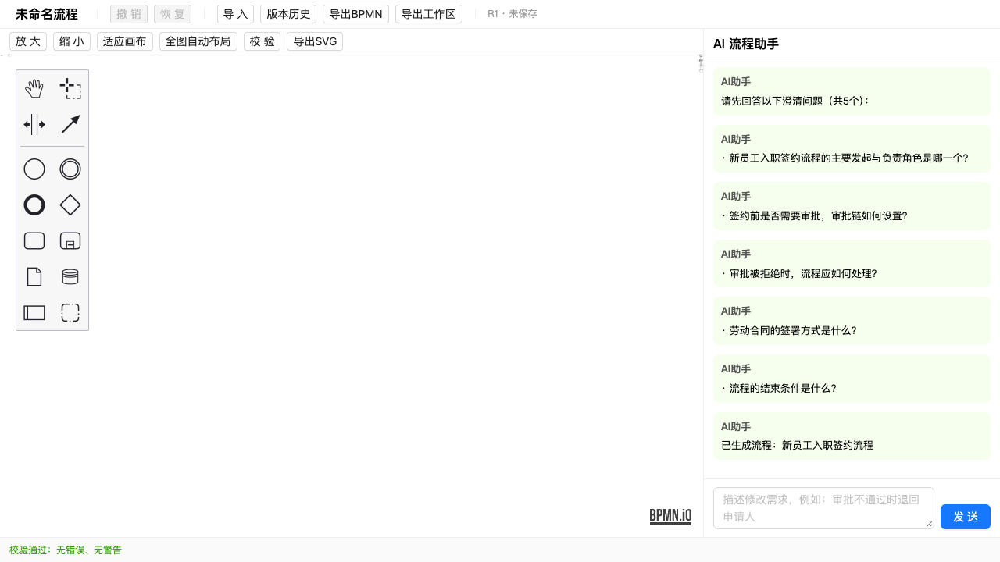
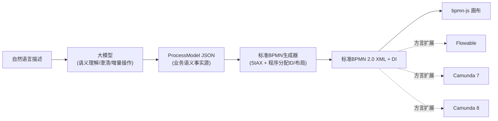
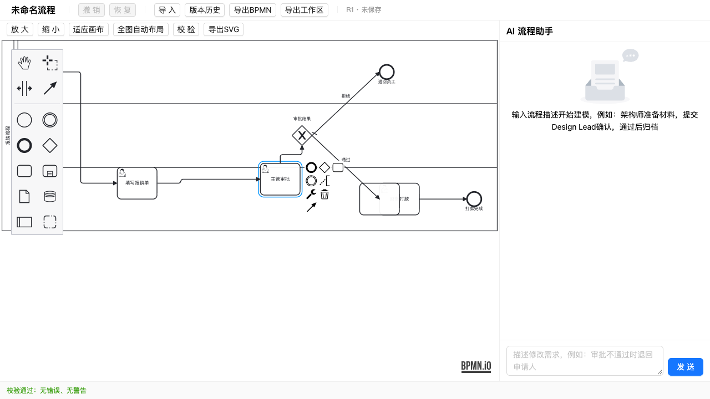
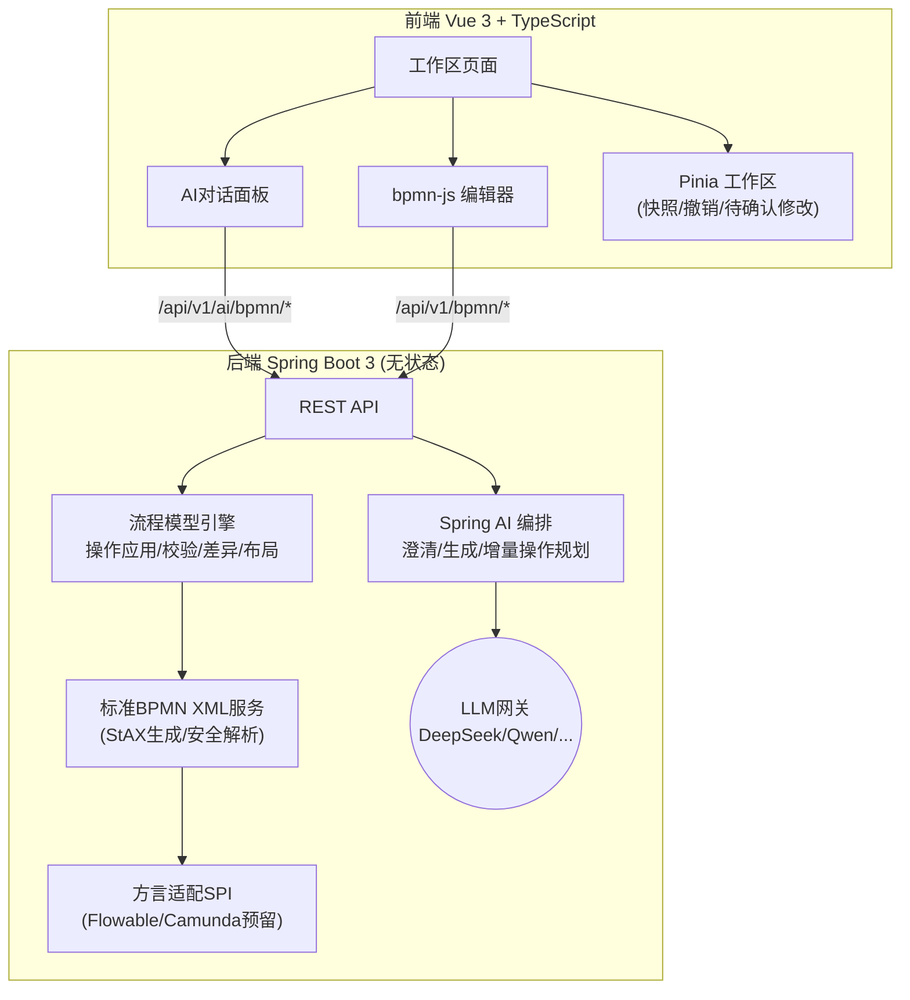

# AI-BPMN Platform

**用自然语言生成和编辑标准 BPMN 2.0 流程图的 AI 建模工作台。**

[](https://openjdk.org/projects/jdk/21/)
[](https://spring.io/projects/spring-boot)
[](https://spring.io/projects/spring-ai)
[](https://vuejs.org/)
[](https://bpmn.io/)
[](#license)

输入一段业务流程描述，AI 自动识别角色、任务、分支与异常路径，生成**厂商中立的标准 BPMN 2.0 XML**（含图形布局）；信息不完整时先提出澄清问题；后续通过多轮对话以**增量操作 + 差异预览**的方式修改流程，且不破坏你手工调整过的布局。



---

## ✨ 核心特性

- **🗣️ 自然语言建模** — 描述流程即可生成含泳道、排他/并行网关、拒绝退回路径的完整流程图
- **❓ 澄清式生成** — 信息不足（缺角色、缺拒绝路径、缺结束条件）时先追问，不擅自猜测
- **🔧 对话式修改 + 差异预览** — AI 只输出白名单增量操作，先预览差异（新增/修改/删除高亮），确认后才应用
- **📐 布局保留** — AI 修改不移动你手工调整过的节点，新节点只做局部布局
- **🎨 可视化编辑** — 基于 bpmn-js 的完整手工编辑：拖拽、连线、改名、Pool/Lane、撤销重做
- **🛡️ 规则校验** — 结构 + 语义 + 行内规范三层校验（孤立节点、死路路径、无条件分支等 16 条规则），支持错误定位
- **💾 本地版本管理** — 自动快照、撤销/恢复、版本时间线，工作区 JSON 一键备份恢复
- **📁 标准导入导出** — 产出标准 BPMN 2.0 XML，可导入 Camunda/Flowable Modeler；工作区 JSON 完整恢复
- **🔌 方言扩展点** — 预留 Flowable / Camunda 7 / Camunda 8 适配器 SPI，标准生成器零侵入
- **🏢 无状态后端** — 不依赖任何数据库/Redis/服务端会话，每个请求自包含，易于水平扩展与容器化
- **🎭 演示模式** — 无模型网关 Key 时可启用内置确定性 Mock，前后端联调开箱即用

### 设计原则：AI 不直接生成 BPMN XML



大模型只负责语义层（理解/澄清/产出结构化操作），**元素 ID 分配、图校验、XML 与图形布局全部由确定性程序完成**——模型输出必须通过 JSON Schema 与白名单校验，杜绝幻觉直接落地。

---

## 🚀 快速开始

### 环境要求

- JDK 21+、Maven 3.9+
- Node.js 18+、npm 10+
- DeepSeek 或其他 OpenAI 兼容模型的 API Key（可选，无 Key 可用演示模式）

### 1️⃣ 启动后端

```bash
git clone https://github.com/your-org/ai-bpmn-platform.git
cd ai-bpmn-platform/backend

export AI_API_KEY=sk-你的密钥          # DeepSeek等OpenAI兼容网关
mvn spring-boot:run
```

后端运行在 `http://localhost:8080`，接口文档：<http://localhost:8080/swagger-ui.html>

### 2️⃣ 启动前端

```bash
cd ai-bpmn-platform/frontend
npm install
npm run dev
```

打开 <http://localhost:5173> 即可使用。

### 3️⃣ 模型配置

编辑 `backend/src/main/resources/application.yml`（推荐用环境变量覆盖，避免密钥入库）：

```yaml
spring:
  ai:
    openai:
      base-url: ${AI_BASE_URL:https://api.deepseek.com}   # 任意OpenAI兼容网关
      api-key: ${AI_API_KEY:unused}
      chat:
        options:
          model: ${AI_MODEL:deepseek-v4-flash}
          temperature: 0.1

app:
  ai:
    mock-enabled: ${AI_MOCK_ENABLED:false}   # true=无Key演示模式(内置Mock)
```

| 环境变量 | 说明 | 默认值 |
|---|---|---|
| `AI_BASE_URL` | OpenAI 兼容网关地址 | `https://api.deepseek.com` |
| `AI_API_KEY` | API 密钥 | — |
| `AI_MODEL` | 模型 ID | `deepseek-v4-flash` |
| `AI_MOCK_ENABLED` | 演示模式开关 | `false` |
| `CORS_ALLOWED_ORIGINS` | 允许的前端来源 | `http://localhost:5173` |

---

## 📖 使用示例

```text
你：员工填写报销单，直属主管审批，金额超过5000元需要总监加签，
    审批通过后财务打款，拒绝则退回员工修改

AI：（可选）提出澄清问题 → 你作答后继续

AI：已生成流程 ✅  →  画布渲染完整流程图（含泳道/网关/退回路径）

你：在财务打款之前增加一个合规审查环节
AI：已生成修改预览：新增[合规审查]任务及2条连线  →  [应用修改] [放弃修改]
```



更多能力：AI 流程解释 / 优化建议 / 语义检查、版本快照回滚、BPMN 与工作区 JSON 导入导出——详见 **[USAGE.md](USAGE.md)** 使用说明。

---

## 🏗️ 架构



**为什么这样设计？**

| 决策 | 理由 |
|---|---|
| AI 不直接生成 XML | 模型输出经 Schema 校验 + 白名单操作落地，ID/布局/校验由程序保证正确性 |
| ProcessModel 为唯一事实源 | 业务语义（供 AI）与交换格式（BPMN XML，供人/引擎）解耦 |
| 增量操作而非整体替换 | 支持差异预览、布局保留、过期保护等精细控制 |
| 后端无状态、无数据库 | 所有上下文由请求携带，部署极简，天然可扩展 |

完整设计规格见 **[DESIGN.md](DESIGN.md)**。

---

## 📁 项目结构

```text
ai-bpmn-platform/
├── backend/                        # Spring Boot 3.4 + Spring AI（Java 21）
│   └── src/main/java/com/bank/aibpmn/
│       ├── agent/                  # AI编排：生成/澄清/修改规划/结构化输出
│       ├── application/dto/        # REST 请求/响应契约
│       ├── controller/             # AI API + BPMN工具 API
│       ├── domain/
│       │   ├── model/              # ProcessModel 语义模型
│       │   ├── operation/          # 增量操作引擎（15种白名单操作）
│       │   ├── diff/               # 差异计算
│       │   ├── layout/             # 布局服务（局部布局/全图布局）
│       │   └── validation/         # BPMN-001~016 规则校验
│       ├── infrastructure/
│       │   ├── ai/                 # LLM客户端（SpringAI / Mock演示）
│       │   ├── bpmn/               # 标准BPMN XML生成器(StAX)/安全解析器
│       │   └── dialect/            # 方言适配扩展点
│       └── config/ exception/
├── frontend/                       # Vue 3 + Vite + Pinia + Ant Design Vue + bpmn-js
│   └── src/
│       ├── api/                    # Axios 封装
│       ├── components/             # BpmnEditor / AiChatPanel / ChangePreview ...
│       ├── pages/                  # 工作区主页面
│       └── stores/                 # Pinia 工作区状态（快照/撤销）
├── contracts/                      # 前后端公共 JSON Schema
├── samples/                        # 示例 BPMN / 工作区文件
├── docs/                           # 文档与截图
├── DESIGN.md                       # 完整设计规格（28章）
├── USAGE.md                        # 使用说明
└── EXTENSION.md                    # 扩展点说明（Flowable适配方案）
```

---

## 🔌 API 一览

| 方法 | 路径 | 说明 |
|---|---|---|
| POST | `/api/v1/ai/bpmn/generate` | 文字描述生成流程（可能返回澄清问题） |
| POST | `/api/v1/ai/bpmn/clarify` | 携带澄清答案重新生成 |
| POST | `/api/v1/ai/bpmn/modify-preview` | 对话修改预览（差异 + 预览XML） |
| POST | `/api/v1/ai/bpmn/explain` / `optimize` / `semantic-check` | 流程解释 / 优化建议 / 语义检查 |
| POST | `/api/v1/bpmn/xml/generate` | ProcessModel → 标准XML |
| POST | `/api/v1/bpmn/xml/parse` | 标准XML → ProcessModel |
| POST | `/api/v1/bpmn/validate/model` / `validate/xml` | 模型/XML 校验 |
| POST | `/api/v1/bpmn/layout` | 全图自动布局 |
| GET | `/api/v1/bpmn/capabilities` | 支持的元素与方言 |

---

## ✅ 质量保障

```bash
# 后端测试（26个：XML往返、XXE防护、增量操作引擎、校验规则、输出契约）
cd backend && mvn test

# 前端测试
cd frontend && npm test
```

安全设计：XML 外部实体/DTD/XInclude 全面拒绝、模型输出 Schema 校验、操作白名单、API Key 仅环境变量注入、错误响应不泄露内部信息。

---

## 🗺️ Roadmap

- [x] 标准BPMN 2.0 生成/解析/校验
- [x] 澄清式生成与对话增量修改
- [x] bpmn-js 可视化编辑与本地版本管理
- [ ] Flowable 方言适配器（方案见 [EXTENSION.md](EXTENSION.md)）
- [ ] Camunda 7 / Camunda 8 适配器
- [ ] 平台属性面板（assignee/candidateGroups 等）
- [ ] Inclusive Gateway、边界事件、定时事件
- [ ] Docker Compose 一键部署

---

## 📄 License

本项目基于 MIT 协议开源（发布前请添加 LICENSE 文件）。

> ⚠️ 注意：系统产出与导入的流程内容属于使用者，API Key 等凭据请勿提交至版本库。
